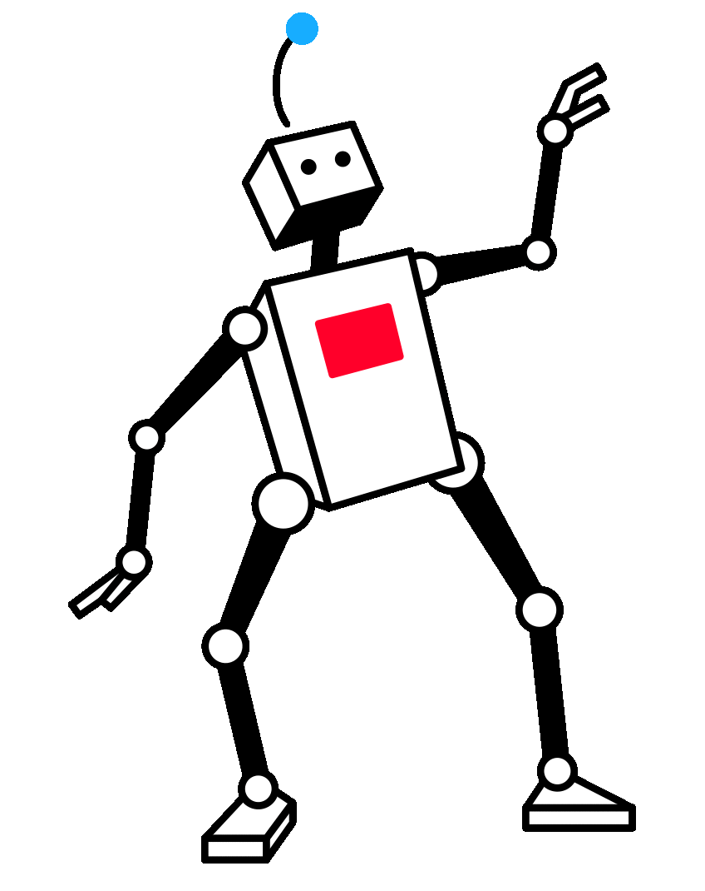

# Willkommen auf meinem Github Profil 

# Wer bin ich?
- Mein Name ist Henry Rausch
- Ich arbeite als Fachinformatiker für Systemintegration in Magdeburg
- Ich bin derzeit Tätig für die [DNS DNS Datentechnik, Netzwerk und Systemhaus GmbH](https://systempartner.de)
- Das ist mein privater Github Account

## Ich beschätige mich mit...
- Golang 
- Python 
- Rust 
- PowerShell 
- Bash 
- Webseiten 
- IT-Sicherheit 
- Docker 
- Container 

## Meine Technologien umfassen..
- AWS 
- Cloudflare 
- Raspberry Pi 
- Windows 
- Linux Server 
- VS Code 

&#x1f4c8; GitHub Stats

</img>
Die Icons sind von der tollen Website und Sponsor von Github Education [Icons8](https://icons8.com)

<!--
how do I set a image size?

>

<!--
**DNS-HRA/DNS-HRA** is a ✨ _special_ ✨ repository because its `README.md` (this file) appears on your GitHub profile.

Here are some ideas to get you started:

- 🔭 I’m currently working on ...
- 🌱 I’m currently learning ...
- 👯 I’m looking to collaborate on ...
- 🤔 I’m looking for help with ...
- 💬 Ask me about ...
- 📫 How to reach me: ...
- 😄 Pronouns: ...
- ⚡ Fun fact: ...
-->
