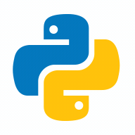
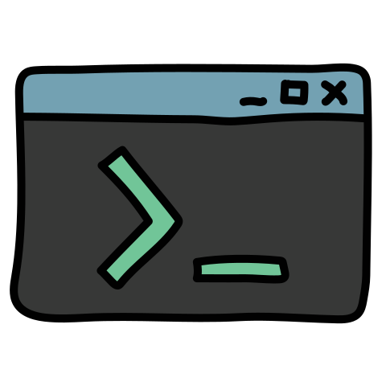
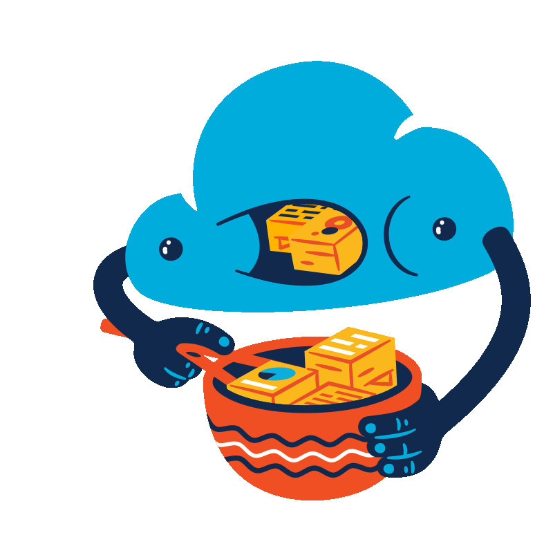

# Willkommen auf meinem Github Profil 

# Wer bin ich?
- Mein Name ist Henry Rausch
- Ich arbeite als Fachinformatiker für Systemintegration in Magdeburg
- Das ist mein privater Github Account

## Ich beschätige mich mit...
- Golang 
- Python 
- Rust 
- PowerShell 
- Bash 
- Webseiten 
- IT-Sicherheit 
- Docker 
- Container 
- Ansible 
- Vagrant 
- Terraform 
- Dokumentationen mit Markdown 

## Meine Technologien umfassen..
- AWS 
- Cloudflare 
- Raspberry Pi 
- Windows 
- Linux Server 
- VS Code 

&#x1f4c8; GitHub Stats

 

 

 

> __Note__  
</img>
Die Icons sind von der tollen Website und Sponsor von Github Education [Icons8](https://icons8.com)
