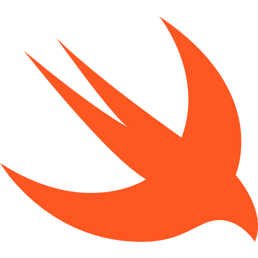
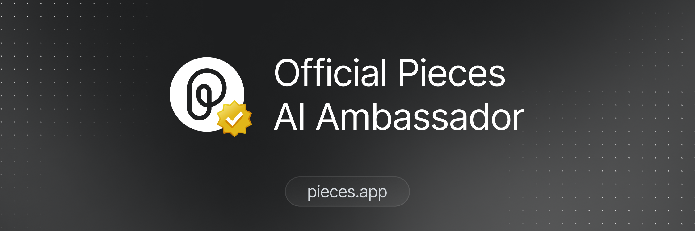

# Welcome to my GitHub Profile

# Who am I?
- My Name is Henry Rausch
- I work as an IT-Operator in Germany

## I work on...
- Golang 
- Python 
- Swift 
- Bash 
- Container 
- Ansible 
- Terraform 
- Cloud Providers 
- Cloudflare 
- Raspberry Pi 
- Linux Server 

  

    My Certifications 🚀
  

  
 
  
 

 

 

&#x1f4c8; GitHub Stats

 

 

 

</img>
Icons provided by [Icons8](https://icons8.com)
